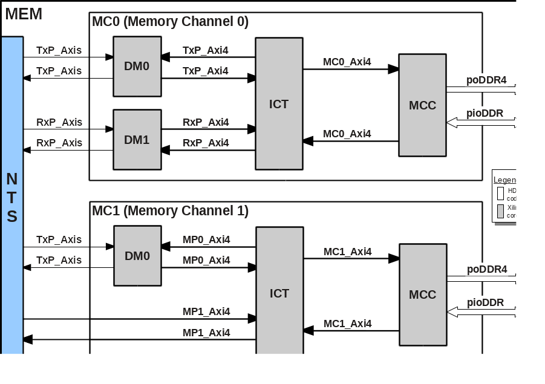

# DDR4 Memory Sub-System (MEM)
This document describes the design of the **DDR4 Memory sub-system (MEM)** used by the _cloudFPGA_ platform.

## Overview
A block diagram of **`MEM`** is depicted in Figure 1.  It features two DDR4 _Memory Channels (MC0 and MC1)_, each with a capacity of 8GB. The memory channel #0 (MC0) is dedicated to the network transport stack (NTS) of the _Shell_ and cannot be used by the _Role_. Instead, the user's application has full access to the 8 GB of memory channel #1 (MC1).


<p align="center"><b>Figure-1: Block diagram of the Memory Sub-System</b></p>

The components in _gray_ color are IP cores generated from the Xilinx IP library. Refer to the [list of components](#list-of-components) for a detail description of these IP cores.   

## List of Components
The following table lists the sub-components of **`MEM`** and provides a link to their documentation as well as their architecture body.  

| Entity                  | Description                   | Architecture
|:------------------------|:------------------------------|:--------------
| **MEM**                 | Memory Sub-System             | [memSubSys](../../SRA/LIB/SHELL/LIB/hdl/mem/memSubSys.v) 
| **MEM/MC0**             | Memory Channel 0              | [memChan_DualPort](../../SRA/LIB/SHELL/LIB/hdl/mem/memChan_DualPort.v)
| **MEM/MC1**             | Memory Channel 1              | [memChan_DualPort_Hybrid](../../SRA/LIB/SHELL/LIB/hdl/mem/memChan_DualPort_Hybrid.v) 
| **MEM/MC[0,1]/DM[0,1]** | AXI Data Mover                | [PG022](https://www.xilinx.com/support/documentation/ip_documentation/axi_datamover/v5_1/pg022_axi_datamover.pdf)
| **MEM/MC[0,1]/ICT**     | AXI Interconnect              | [PG059](https://www.xilinx.com/support/documentation/ip_documentation/axi_interconnect/v2_1/pg059-axi-interconnect.pdf)
| **MEM/MC[0,1]/MCC**     | UltraScale Architecture-Based | [PG150](https://www.xilinx.com/support/documentation/ip_documentation/ultrascale_memory_ip/v1_4/pg150-ultrascale-memory-ip.pdf)
|                         | FPGAs Memory IP               | 

## Description of the Interfaces
The **`MEM`** entity consists of 3 groups of interfaces referred to as:
 * the [AXI Streaming Interface](#axi-streaming-interface), 
 * the [AXI Memory-Mapped Interface](#axi-memory-mapped-interface),
 * the [DDR4 Physical Interface](#ddr4-physical-interface).

### AXI Streaming Interface

### AXI Memory-Mapped Interface

### DDR4 Physical Interface


## Things to know and document later

### Burst sizes

- AXI4 protocol has two restrictions:
  - maximum 4096 Bytes
  - maximum 256 transactions
  - so the actual burst limt depends on the data width

- MC1 (connected to the Role)
  - use `memChan_DualPort_Hybrid` (for Kale & Themisto)
  - Streaming mode using AXI data mover: **64** max burst length (data size 64Bytes)
  - Memory mapped mode (directly connected to Axi interconnect): also 64 (since data size is also 512)
  - config parameters `READ_ACCEPTANCE` and `WRITE_ACCEPTANCE`: means the number of outstanding transfers, which must be equal to `2^ID_WIDTH`. 
  - **DRE** is enabled for user, ID width is changed to 8
  - MC1 has a burst size of 64, also for the data mover

- MC0 (connected to the Shell):
  - use `memChan_DualPort`
  - burst size is limited to **16** ?
  - depending on `gUserDataChanWidth`

### Adressing

- addresses for AXI are always **line based**
- so if one line has the width of 512 bits = 64 Bytes, then the address field of AXI is based on that
- e.g. address 0x3 in `ARADDR` means reading bytes 128 -- 191. 
- this is true for memory-mapped and streaming interfaces

### HLS pragmas

for memory-mapped:
```
void main(
...
int32_t boFdram[MEM_SIZE],
...
);
{
...
#pragma HLS INTERFACE m_axi port=boFdram bundle=boAPP_DRAM offset=direct latency=52 num_read_outstanding=16 num_write_outstanding=16 max_read_burst_length=256 max_write_burst_length=256
//so for int32, max burst size for memory-mapped AXI4 is 1KiB, since the length is limited to 256
//num_outstanding comes from AXI Interconnect config
//latency is based on measurements
//offset direct means that there will be a address port in HDL that is the basis for the physical addresses

//access bytes 4 -- 7
ap_uint<32> tmp = boFdram[1];

...
}

```


