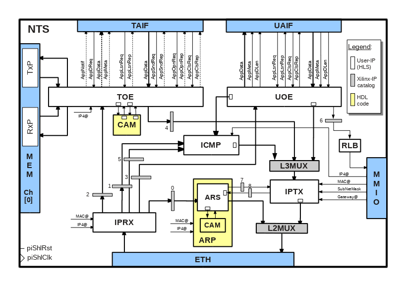

# Network Transport Stack (NTS)
This document describes the design of the **TCP/IP Network and Transport Stack (NTS)** used by the *cloudFPGA* platform.  

## Preliminary and Acknowledgments
This code was initially developed by **Xilinx Dublin Labs, Ireland** who kindly accepted to share it with the
 *cloudFPGA project* via the *GitHub* repository: https://github.com/Xilinx/HLx_Examples/tree/master/Acceleration/tcp_ip.
  In 2018, the code was ported and adapted for the needs and specificity of the *cloudFPGA* platform.

FYI - An enhanced branch of the initial *Xilinx* code is maintained by the **Systems Group @ ETH Zurich** and can be
 found [here](https://github.com/fpgasystems/fpga-network-stack).    

## Overview
A block diagram of the **`NTS`** is depicted in Figure 1. It features a *User Datagram Protocol (UDP)* engine , a
 *Transmission Control Protocol Offload Engine (TOE)*, an *Internet Control Message Protocol (ICMP)* server and an 
 *Address Resolution Protocol (ARP) Server*.

<p align="center"><b>Figure-1: Block diagram of the of the Network Transport Stack</b></p>

The **`NTS`** is predominantly written in C/C++ with a few pieces coded in HDL (see Figure-1). The top-level that 
 assembles and interconnects all the components, is the Verilog file [**nts_TcpIp.v**](../../SRA/LIB/SHELL/LIB/hdl/nts/nts_TcpIp.v). 
 To facilitate the development and the interfacing with other C/C++ cores, we also provide the header file
 [**nts.hpp**](../../SRA/LIB/SHELL/LIB/hls/NTS/nts.hpp). 

For the components specified in C/C++, we use the Xilinx HLS flow to synthesize and export them as a standalone IP cores.
 With respect to Figure-1, the white boxes represent the sub-components specified in C/C++, the yellow boxes the ones
 specified in HDL, while blue boxes represent interfaces to neighbouring IP blocks.

## HLS Coding Style and Naming Conventions
The design of **`NTS`** uses some specific HDL and HLS naming rules to ease the description and the understanding of
 its architecture. Please consider reading the two documents [**HDL coding style and naming conventions**](../hdl-naming-conventions.md)
  and [**HLS coding style and naming conventions**](./hls-naming-conventions.md) before diving into the code or starting
  to contribute to this part of the cloudFPGA project.

## List of Components
The following table lists the sub-components of **`NTS`** and provides a link to their documentation as well as their
architecture body. 

| Entity              | Description                                       | Architecture
|:-------------------:|:--------------------------------------------------|:--------------
| **[ARS](ARS.md)**   | Address Resolution Server (ARS).                  | [arp_server](../../SRA/LIB/SHELL/LIB/hls/NTS/arp/src/arp.cpp)
| **[ICMP](ICMP.md)** | Internet Control Message Protocol (ICMP) server.  | [icmp_server](../../SRA/LIB/SHELL/LIB/hls/NTS/icmp/src/icmp.cpp)
| **[IPRX](IPRX.md)** | IP Receive frame handler (IPRX).                  | [iprx_handler](../../SRA/LIB/SHELL/LIB/hls/NTS/iprx/src/iprx.cpp)
| **[IPTX](IPTX.md)** | IP Transmit frame handler (IPTX).                 | [iptx_handler](../../SRA/LIB/SHELL/LIB/hls/NTS/iptx/src/iptx.cpp)
| **[TOE](./TOE.md)** | TCP Offload Engine.                               | [toe](../../SRA/LIB/SHELL/LIB/hls/NTS/toe/src/toe.cpp)
| **[UOE](./UOE.md)** | UDP Offload Engine.                               | [uoe](../../SRA/LIB/SHELL/LIB/hls/NTS/uoe/src/uoe.cpp)

## Description of the Interfaces
The entity declaration of **`NTS`** is specified as follows. It consists of 5 groups of interfaces referred to as:
 * the [Memory Mapped IO Interface](#memory-mapped-io-interface) (MMIO), 
 * the [Ethernet Data Link Layer-2 Interface](#ethernet-data-link-layer-2-interface) (ETH),
 * the [TCP Application Layer Interface](#tcp-application-layer-interface) (TAIF),
 * the [UDP Application Layer Interface](#udp-application-layer-interface) (UAIF),
 * the [Memory System Interface](#memory-system-interface) (MEM),
 
```
module NetworkTransportStack_TcpIp (

  //------------------------------------------------------
  //-- Global Clock used by the entire SHELL
  //--   (This is typically 'sETH0_ShlClk' and we use it all over the place)
  //------------------------------------------------------ 
  input          piShlClk,
  //------------------------------------------------------
  //-- Global Reset used by the entire SHELL
  //--  This is typically 'sETH0_ShlRst'. If the module is created by HLS,
  //--   we use it as the default startup reset of the module.)
  //------------------------------------------------------ 
  input          piShlRst,
  //------------------------------------------------------
  //-- ETH / Ethernet Layer-2 Interfaces
  //------------------------------------------------------
  //--  Axi4-Stream Ethernet Rx Data --------
  input [ 63:0]  siETH_Data_tdata, 
  input [  7:0]  siETH_Data_tkeep,
  input          siETH_Data_tlast,
  input          siETH_Data_tvalid,
  output         siETH_Data_tready,
  //-- Axi4-Stream Ethernet Tx Data --------
  output [ 63:0] soETH_Data_tdata,
  output [  7:0] soETH_Data_tkeep,
  output         soETH_Data_tlast,
  output         soETH_Data_tvalid,
  input          soETH_Data_tready,
  //------------------------------------------------------
  //-- MEM / TxP Interfaces
  //------------------------------------------------------
  //-- FPGA Transmit Path / S2MM-AXIS --------------------
  //---- Axi4-Stream Read Command -----------
  output[ 79:0]  soMEM_TxP_RdCmd_tdata,
  output         soMEM_TxP_RdCmd_tvalid,
  input          soMEM_TxP_RdCmd_tready,
  //---- Axi4-Stream Read Status ------------
  input [  7:0]  siMEM_TxP_RdSts_tdata,
  input          siMEM_TxP_RdSts_tvalid,
  output         siMEM_TxP_RdSts_tready,
  //---- Axi4-Stream Data Input Channel ----
  input [ 63:0]  siMEM_TxP_Data_tdata,
  input [  7:0]  siMEM_TxP_Data_tkeep,
  input          siMEM_TxP_Data_tlast,
  input          siMEM_TxP_Data_tvalid,
  output         siMEM_TxP_Data_tready,
  //---- Axi4-Stream Write Command ----------
  output [ 79:0] soMEM_TxP_WrCmd_tdata,
  output         soMEM_TxP_WrCmd_tvalid,
  input          soMEM_TxP_WrCmd_tready,
  //---- Axi4-Stream Write Status -----------
  input [  7:0]  siMEM_TxP_WrSts_tdata,
  input          siMEM_TxP_WrSts_tvalid,
  output         siMEM_TxP_WrSts_tready,
  //---- Axi4-Stream Data Output Channel ----
  output [ 63:0] soMEM_TxP_Data_tdata,
  output [  7:0] soMEM_TxP_Data_tkeep,
  output         soMEM_TxP_Data_tlast,
  output         soMEM_TxP_Data_tvalid,
  input          soMEM_TxP_Data_tready,
  //------------------------------------------------------
  //-- MEM / RxP Interfaces
  //------------------------------------------------------
  //-- FPGA Receive Path / S2MM-AXIS -------------
  //---- Axi4-Stream Read Command -----------
  output [ 79:0] soMEM_RxP_RdCmd_tdata,
  output         soMEM_RxP_RdCmd_tvalid,
  input          soMEM_RxP_RdCmd_tready,
  //---- Axi4-Stream Read Status ------------
  input [   7:0] siMEM_RxP_RdSts_tdata,
  input          siMEM_RxP_RdSts_tvalid,
  output         siMEM_RxP_RdSts_tready,
  //---- Axi4-Stream Data Input Channel -----
  input [ 63:0]  siMEM_RxP_Data_tdata,
  input [  7:0]  siMEM_RxP_Data_tkeep,
  input          siMEM_RxP_Data_tlast,
  input          siMEM_RxP_Data_tvalid,
  output         siMEM_RxP_Data_tready,
  //---- Axi4-Stream Write Command ----------
  output[ 79:0]  soMEM_RxP_WrCmd_tdata,
  output         soMEM_RxP_WrCmd_tvalid,
  input          soMEM_RxP_WrCmd_tready,
  //---- Axi4-Stream Write Status -----------
  input [  7:0]  siMEM_RxP_WrSts_tdata,
  input          siMEM_RxP_WrSts_tvalid,
  output         siMEM_RxP_WrSts_tready,
  //---- Axi4-Stream Data Input Channel -----
  output [ 63:0] soMEM_RxP_Data_tdata,
  output [  7:0] soMEM_RxP_Data_tkeep,
  output         soMEM_RxP_Data_tlast,
  output         soMEM_RxP_Data_tvalid,
  input          soMEM_RxP_Data_tready,
  //------------------------------------------------------
  //-- UAIF / UDP Tx Data Interfaces (.i.e APP-->NTS)
  //------------------------------------------------------
  //---- Axi4-Stream UDP Data ---------------
  input   [63:0] siAPP_Udp_Data_tdata,
  input   [ 7:0] siAPP_Udp_Data_tkeep,
  input          siAPP_Udp_Data_tlast,
  input          siAPP_Udp_Data_tvalid,
  output         siAPP_Udp_Data_tready,
  //---- Axi4-Stream UDP Metadata -----------
  input   [95:0] siAPP_Udp_Meta_tdata,
  input          siAPP_Udp_Meta_tvalid,
  output         siAPP_Udp_Meta_tready,
  //---- Axi4-Stream UDP Data Length --------
  input   [15:0] siAPP_Udp_DLen_tdata,
  input          siAPP_Udp_DLen_tvalid,
  output         siAPP_Udp_DLen_tready,
  //------------------------------------------------------
  //-- UAIF / Rx Data Interfaces (.i.e NTS-->APP)
  //------------------------------------------------------
  //---- Axi4-Stream UDP Data ---------------
  output  [63:0] soAPP_Udp_Data_tdata,
  output  [ 7:0] soAPP_Udp_Data_tkeep,
  output         soAPP_Udp_Data_tlast,
  output         soAPP_Udp_Data_tvalid,
  input          soAPP_Udp_Data_tready,
  //---- Axi4-Stream UDP Metadata -----------
  output  [95:0] soAPP_Udp_Meta_tdata,
  output         soAPP_Udp_Meta_tvalid,
  input          soAPP_Udp_Meta_tready,
  //---- Axi4-Stream UDP Data Length --------
  output  [15:0] soAPP_Udp_DLen_tdata,
  output         soAPP_Udp_DLen_tvalid,
  input          soAPP_Udp_DLen_tready,
  //------------------------------------------------------
  //-- UAIF / UDP Rx Ctrl Interfaces (.i.e NTS-->APP)
  //------------------------------------------------------
  //---- Axi4-Stream UDP Listen Request -----
  input   [15:0] siAPP_Udp_LsnReq_tdata,
  input          siAPP_Udp_LsnReq_tvalid,
  output         siAPP_Udp_LsnReq_tready,
  //---- Axi4-Stream UDP Listen Reply -------
  output  [ 7:0] soAPP_Udp_LsnRep_tdata,
  output         soAPP_Udp_LsnRep_tvalid,
  input          soAPP_Udp_LsnRep_tready,
  //---- Axi4-Stream UDP Close Request ------
  input   [15:0] siAPP_Udp_ClsReq_tdata,
  input          siAPP_Udp_ClsReq_tvalid,
  output         siAPP_Udp_ClsReq_tready,
  //---- Axi4-Stream UDP Close Reply --------
  output  [ 7:0] soAPP_Udp_ClsRep_tdata,
  output         soAPP_Udp_ClsRep_tvalid,
  input          soAPP_Udp_ClsRep_tready,
  //------------------------------------------------------
  //-- TAIF / Tx Data Interfaces (.i.e APP-->NTS)
  //------------------------------------------------------
  //---- Axi4-Stream APP Data ---------------
  input [ 63:0]  siAPP_Tcp_Data_tdata,
  input [  7:0]  siAPP_Tcp_Data_tkeep,
  input          siAPP_Tcp_Data_tvalid,
  input          siAPP_Tcp_Data_tlast,
  output         siAPP_Tcp_Data_tready,
  //---- Axi4-Stream APP Send Request -------
  input [ 31:0]  siAPP_Tcp_SndReq_tdata,
  input          siAPP_Tcp_SndReq_tvalid,
  output         siAPP_Tcp_SndReq_tready,
  //---- Axi4-Stream APP Send Reply ---------
  output [ 55:0] soAPP_Tcp_SndRep_tdata,
  output         soAPP_Tcp_SndRep_tvalid,
  input          soAPP_Tcp_SndRep_tready,
  //------------------------------------------------------
  //-- TAIF / Rx Data Interfaces (.i.e NTS-->APP)
  //------------------------------------------------------
  //-- Axi4-Stream TCP Data -----------------
  output [ 63:0] soAPP_Tcp_Data_tdata,
  output [  7:0] soAPP_Tcp_Data_tkeep,
  output         soAPP_Tcp_Data_tvalid,
  output         soAPP_Tcp_Data_tlast,
  input          soAPP_Tcp_Data_tready,
  //--  Axi4-Stream TCP Metadata ------------
  output [ 15:0] soAPP_Tcp_Meta_tdata,
  output         soAPP_Tcp_Meta_tvalid,
  input          soAPP_Tcp_Meta_tready,
  //--  Axi4-Stream TCP Data Notification ---
  output [103:0] soAPP_Tcp_Notif_tdata,
  output         soAPP_Tcp_Notif_tvalid,
  input          soAPP_Tcp_Notif_tready,
  //--  Axi4-Stream TCP Data Request --------
  input  [ 31:0] siAPP_Tcp_DReq_tdata,
  input          siAPP_Tcp_DReq_tvalid,
  output         siAPP_Tcp_DReq_tready,
  //------------------------------------------------------
  //-- TAIF / Tx Ctlr Interfaces (.i.e APP-->NTS)
  //------------------------------------------------------
  //---- Axi4-Stream TCP Open Session Request
  input [ 47:0]  siAPP_Tcp_OpnReq_tdata,
  input          siAPP_Tcp_OpnReq_tvalid,
  output         siAPP_Tcp_OpnReq_tready,
  //---- Axi4-Stream TCP Open Session Reply
  output [ 23:0] soAPP_Tcp_OpnRep_tdata,
  output         soAPP_Tcp_OpnRep_tvalid,
  input          soAPP_Tcp_OpnRep_tready,
  //---- Axi4-Stream TCP Close Request ------
  input [ 15:0]  siAPP_Tcp_ClsReq_tdata,
  input          siAPP_Tcp_ClsReq_tvalid,
  output         siAPP_Tcp_ClsReq_tready,
  //------------------------------------------------------
  //-- TAIF / Rx Ctlr Interfaces (.i.e NTS-->APP)
  //------------------------------------------------------
  //----  Axi4-Stream TCP Listen Request ----
  input [ 15:0]  siAPP_Tcp_LsnReq_tdata,
  input          siAPP_Tcp_LsnReq_tvalid,
  output         siAPP_Tcp_LsnReq_tready,
  //----  Axi4-Stream TCP Listen Ack --------
  output [  7:0] soAPP_Tcp_LsnRep_tdata,  // RepBit stream must be 8-bits boundary
  output         soAPP_Tcp_LsnRep_tvalid,
  input          soAPP_Tcp_LsnRep_tready,
  //------------------------------------------------------
  //-- MMIO / Interfaces
  //------------------------------------------------------
  input          piMMIO_Layer2Rst,
  input          piMMIO_Layer3Rst,
  input          piMMIO_Layer4Rst,
  input          piMMIO_Layer4En,
  input  [ 47:0] piMMIO_MacAddress,
  input  [ 31:0] piMMIO_Ip4Address,
  input  [ 31:0] piMMIO_SubNetMask,
  input  [ 31:0] piMMIO_GatewayAddr,
  output         poMMIO_CamReady,
  output         poMMIO_NtsReady

);
```

### Memory Mapped IO Interface 
The memory mapped IO (MMIO) interface consists of a set of status and configuration IO signals.
```
    //------------------------------------------------------
    //-- MMIO / Interfaces
    //------------------------------------------------------
    input          piMMIO_Layer2Rst,
    input          piMMIO_Layer3Rst,
    input          piMMIO_Layer4Rst,
    input          piMMIO_Layer4En,
    input  [ 47:0] piMMIO_MacAddress,
    input  [ 31:0] piMMIO_Ip4Address,
    input  [ 31:0] piMMIO_SubNetMask,
    input  [ 31:0] piMMIO_GatewayAddr,
    output         poMMIO_CamReady,
    output         poMMIO_NtsReady
```
* `piMMIO_Layer2Rst`, `piMMIO_Layer3Rst` and `piMMIO_Layer4Rst` are active *high* reset signals. The layer number
    corresponds to one of the seven layers of the conceptual OSI network model.
* `piMMIO_Layer4En` is an active *high* enable signal. It can be used to delay the start of the transport layer #4.
* `piMMIO_MacAddress`, `piMMIO_Ip4Address`, `piMMIO_SubNetMask` and `piMMIO_GatewayAddr` are used to configure the *MAC
    address, the *IPv4 address*, the *IP subnet mask* and the *default gateway address* of **`NTS`**, respectively. All
    the addresses must be encoded in network byte oder (i.e. in big-endian order).
* `poMMIO_CamReady` and `poMMIO_NtsReady` are active *high* ready signals. They indicate the readiness of **`NTS`**.

### Ethernet Data Link Layer-2 Interface
The Ethernet data link layer-2 interface (ETH) connects **`NTS`** to a 10 Gigabit Ethernet Media Access Controller
 (10GEMAC). The interface consists of a receive and a transmit path, each of them being implemented as an *AXI4-Stream
  interface* of 64 bits.
  * `siETH_Data_****` is used to receive Ethernet MAC frames from the data link layer-2.
  * `soETH_Data_****` is used to send Ethernet MAC frames to the data link layer-2.
  
### TCP Application Layer Interface
The TCP application layer interface (TAIF) connects **`NTS`** to a network presentation layer such as a TLS process,
 a network application layer such as an HTTP server, or directly to a user application. It consists of a set of
 receive and transmit interfaces, each of them being implemented as an *AXI4-Stream interface*.
 * `siAPP_Tcp_****` signals implement the transmit data and control paths between the application layer and **`NTS`** (i.e., 
    the outgoing network traffic direction). 
 * `soAPP_Tcp_****` signals implement the receive data and control paths between **`NTS`** and the application layer (i.e., 
    the incoming network traffic direction).

Refer to the [TCP Application Layer Interface of TOE](./TOE.md#tcp-application-layer-interface) for a detailed description
of these interfaces. 

### UDP Application Layer Interface
The UDP application layer interface (UAIF) connects **`NTS`** to a network application layer or directly to a user
 application. It consists of a set of receive and transmit interfaces, each of them being implemented as an *AXI4-Stream
 interface*.
* `siAPP_Udp_****` signals implement the transmit data and control paths between the application layer and **`NTS`** (i.e., 
    the outgoing network traffic direction). 
 * `soAPP_Udp_****` signals implement the receive data and control paths between **`NTS`** and the application layer (i.e., 
    the incoming network traffic direction).

Refer to the [UDP Application Layer Interface of UOE](./UOE.md#udp-application-layer-interface) for a detailed description
of these interfaces. 

### Memory System Interface
[TODO - Under construction]
