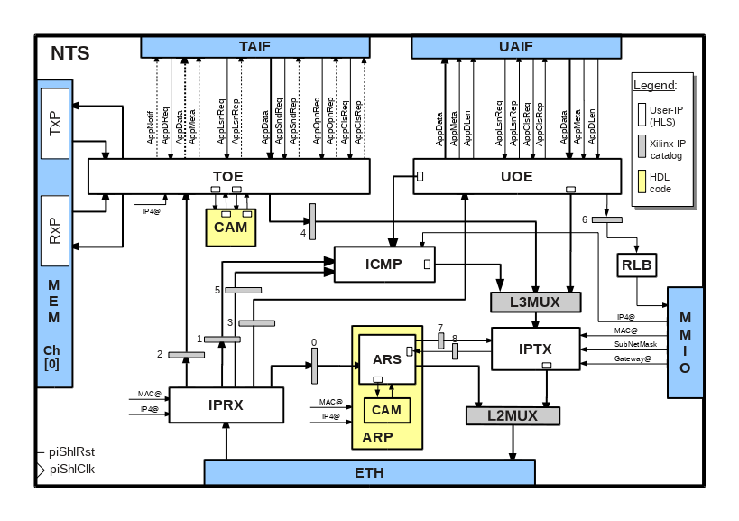

# Network Transport Stack (NTS)
This document describes the design of the **TCP/IP Network and Transport Stack (NTS)** used by the *cloudFPGA* platform.  

## Preliminary and Acknowledgments
This code was initialy developed by **Xilinx Dublin Labs, Ireland** who kindly acepted to share it with the *cloudFPGA project* via the *GitHub* repository: https://github.com/Xilinx/HLx_Examples/tree/master/Acceleration/tcp_ip. In 2018, the code was ported and adapted for the needs and specificities of the *cloudFPGA* platform.

FYI - An enhanced branch of the initial *Xilinx* code is maintained by the **Systems Group @ ETH Zurich** and can be found [here](https://github.com/fpgasystems/fpga-network-stack).    

## Overview
A block diagram of the *NTS* is depicted in Figure 1. It features a *User Datagram Protocol (UDP)* engine , a *Transmission Control Protocol Offload Engine (TOE)*, an *Internet Control Message Protocol (ICMP)* server and an *Address Resolution Protocol (ARP) Server*.

<b>Figure-1: Block diagram of the of the Network Transport Stack</b>
  
 

## HLS Coding Style and Naming Conventions
Please consider reading the following two documents before diving or contributing to this part of the cloudFPGA project.
  1) [**HDL Naming Conventions**](../hdl-naming-conventions.md), 
  2) [**HLS Naming Conventions**](./hls-naming-conventions.md)
 

## List of Interfaces

| Acronym         | Description                                           | Filename
|:----------------|:------------------------------------------------------|:--------------
| **CAM**         | Content Addessable Memory interface.                  | [TODO]
| **IPRX**        | IP Rx Interface.                                      | [TODO]
| **L3MUX**       | Layer-3 Multiplexer interface.                        | [TODO]
| **MEM**         | Memory sub-system (data-mover to DDR4).               | [TODO]
| **TRIF**        | TCP Role Interface (alias APP).                       | tcp_role_interface

## List of HLS Components

| Acronym         | Description                                           | Filename
|:----------------|:------------------------------------------------------|:--------------
| **ARS**         | Address Resolution Protocol (ARP) Server.             | arp_server
| **DHCP**        | Dynamic Host Configuration Protocol (DHCP) client.    | dhcp_client
| **ICMP**        | Internet Control Message Protocol (ICMP) server.      | icmp_server
| **IPRX**        | IP Receiver frame handler (IPRX).                     | iprx_handler
| **IPTX**        | IP Transmit frame handler (IPTX).                     | iptx_handler
| **MPE**         |                                                       | mpe
| **SMC**         |                                                       | smc
| **TRIF**        | TCP Role Interface.                                   | tcp_role_if
| **[TOE](./TOE.md)** | TCP Offload Engine.                                   | toe
| **UDP**         | UDP engine.                                           | udp
| **UDMX**        | UDP Multiplexer.                                      | udp_mux
| **URIF**        | UDP Role Interface.                                   | udp_role_if

 
 

