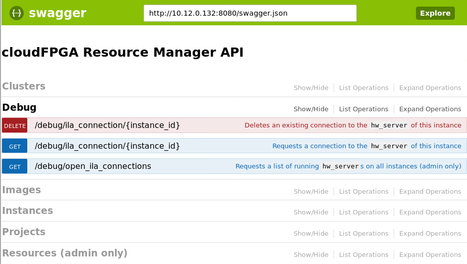
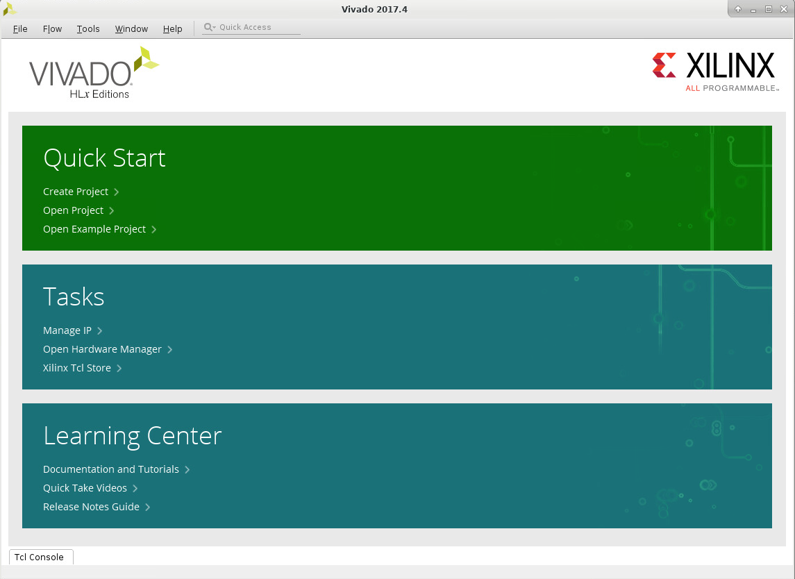
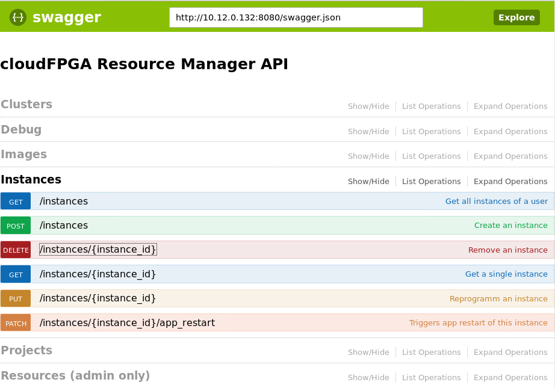
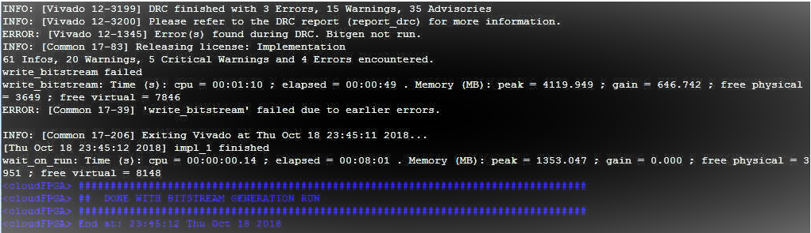

# How to cloudFPGA on ZYC2

Currently cloudFPGA project can be accessed over cloud as an on-prem deployment to Zurich Heterogeneous Cloud, in the Yellow Zone security zone (ZYC2).


## Part-1: ZYC2 Access Authentication and Login
Use CTRL+click or CMD+click to [open Part-1](ZYC2_Access_Authentication_and_Login.md) in a new tab

## Part-2: Development Kit for cloudFPGA

### Step-1: Fetch the cloudFPGA Development Kit
Clone the git repository located at:

[TODO: The cFDK will become Open Source at GitHub]

Until available, use “SRA-r0.2.zip” and extract it in your VM.

### Step-2: Test of the Implementation Flow
TopFlash → Project used to create the content of the Flash

```
cd ./SRA/FMKU60/TOP/TopFlash
make monolithic
```

##


## Part-3: Upload Image, Request and Program FPGA

### Step-1: Access cloudFPGA Resource Manager
Point your browser at http://10.12.0.132:8080/ui
and expand the “Images” section


### Step-2

#### a: Upload an Image (.i.e, an FPGA Bitfile)
Expand the “POST” operation


#### b: Upload an Image (.i.e, an FPGA Bitfile)


#### c: Upload an Image (.i.e, an FPGA Bitfile) GA
Check the “Response Body”


### Step-3

#### a: Request and Program FPGA Instance
Expand the “Instance” section


#### b: Request and Program FPGA Instance  
Expand the “POST” operation


#### c: Request and Program FPGA Instance   
Fill in the parameter fieldsPress the “Try it out!” button


#### d: Request and Program FPGA Instance  
Check the “Response Body”


### Step-4: Ping the IP Address of the FPGA


## Part-4: Remote Debugging with Vivado

### Step-1

#### a: Request Connection to HW Server
Point your browser at http://10.12.0.132:8080/ui
and expand the “Debug” section


#### b: Request Connection to HW Server
Expand the “Get /debug/ila_connection/{instance_id}” operation


#### c: Request Connection to HW Server
Fill in the parameter fields
Press the “Try it out!” button


#### d: Request Connection to HW Server
Check the “Response Body”


### Step-2: Launch Vivado


### Step-3

#### a: Open a New Hardware Target


#### b: Select your Hardware Target


#### c: Here you go...


### Step-4: Further Instance Operations


## Backup

### HowTo: “Hello World”
TopEchoHls (is a kind of 'Hello World')
```
cd ./SRA/FMKU60/TOP/TopEchoHls
make monolithic
```


### HowTo: Test the UDP Loopback w/ netcat
