## Part-2: Development Kit for cloudFPGA

### Step-1: Fetch the cloudFPGA Development Kit
Clone the git repository located at:


[TODO: The cFDK will become Open Source at GitHub]

Until available, use “SRA-r0.2.zip” and extract it in your VM.

### Step-2: Test of the Implementation Flow
TopFlash → Project used to create the content of the Flash

```
cd ./SRA/FMKU60/TOP/TopFlash
make monolithic
```

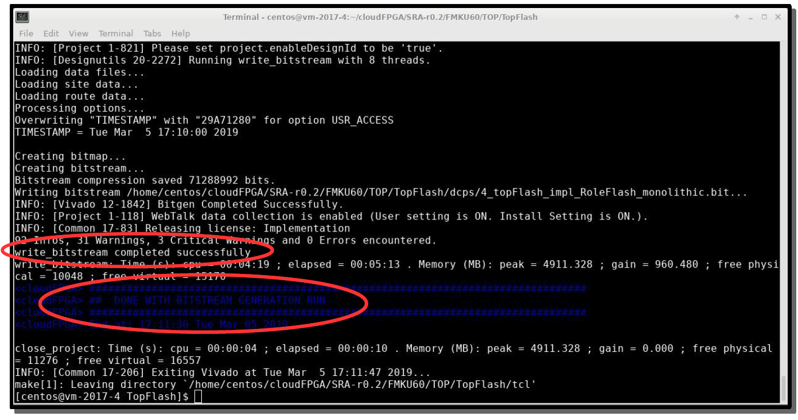

## Part-3: Upload Image, Request and Program FPGA

### Step-1: Access cloudFPGA Resource Manager
Point your browser at [http://10.12.0.132:8080/ui](http://10.12.0.132:8080/ui)
and expand the “Images” section

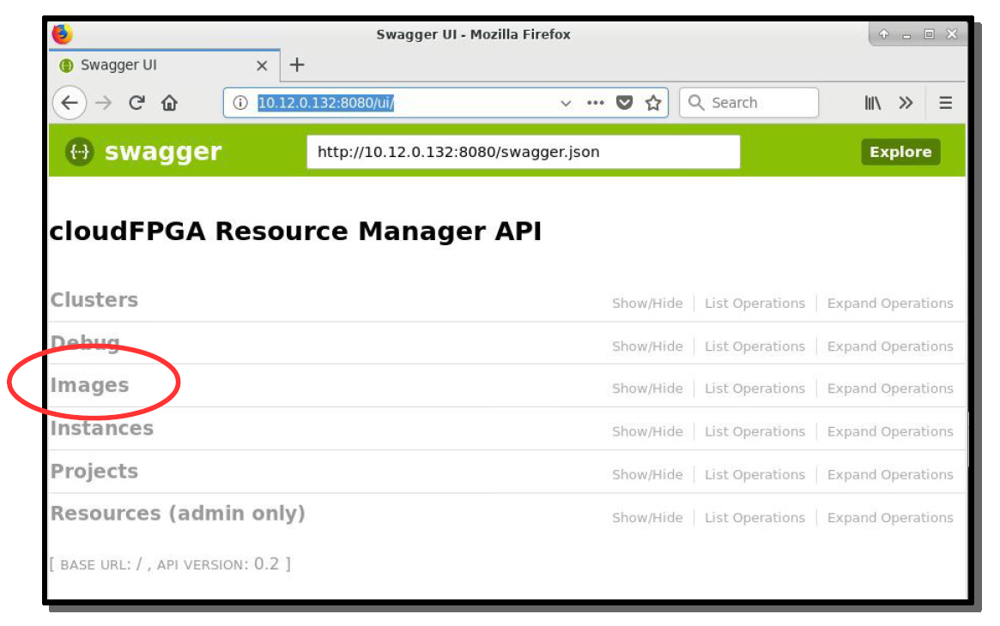

### Step-2: Upload an Image

#### Step-2a: Expand the “POST” operation

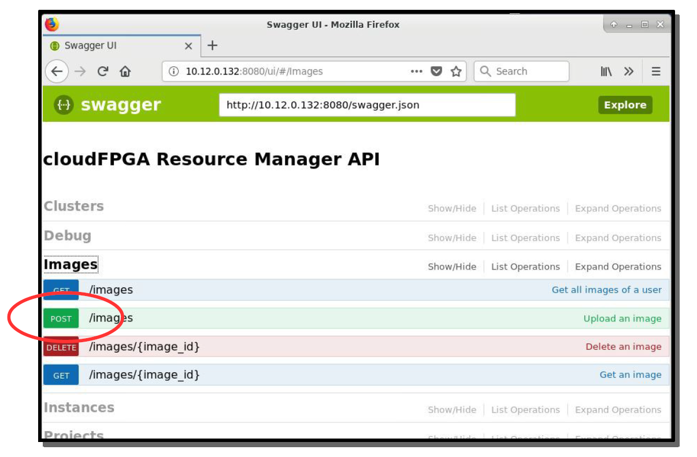

#### Step-2b: Fill in the parameter fields

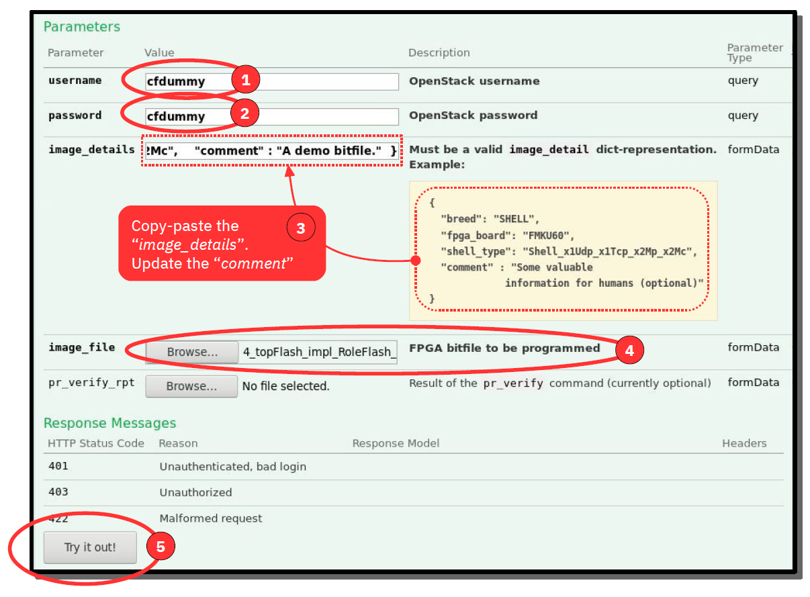

#### Step-2c: Check the “Response Body”

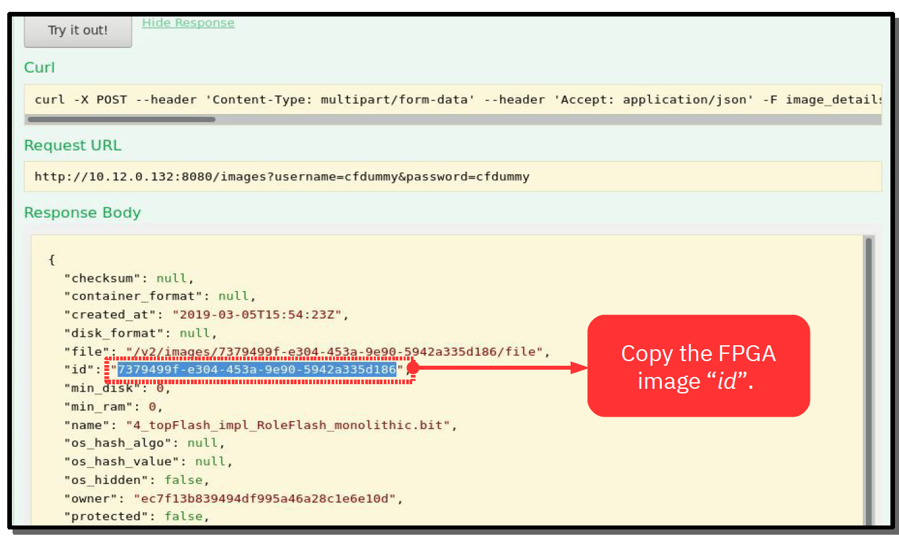

### Step-3: Request and Program FPGA Instance

#### Step-3a: Expand the “Instance” section

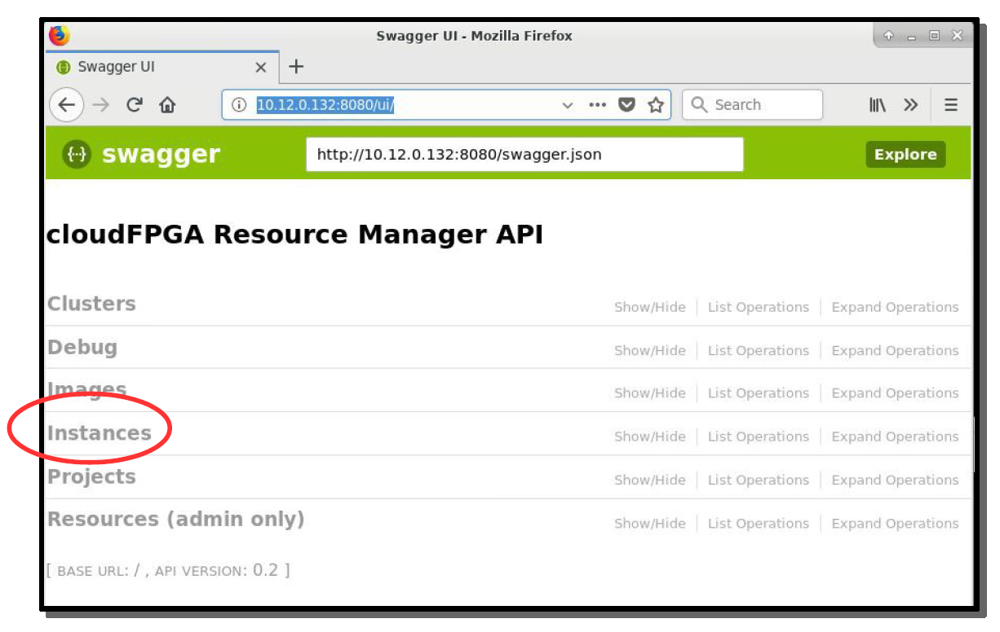

#### Step-3b: Expand the “POST” operation


#### Step-3c: Fill in the parameter fields

And press the “Try it out!” button


#### Step-3d: Check the “Response Body”

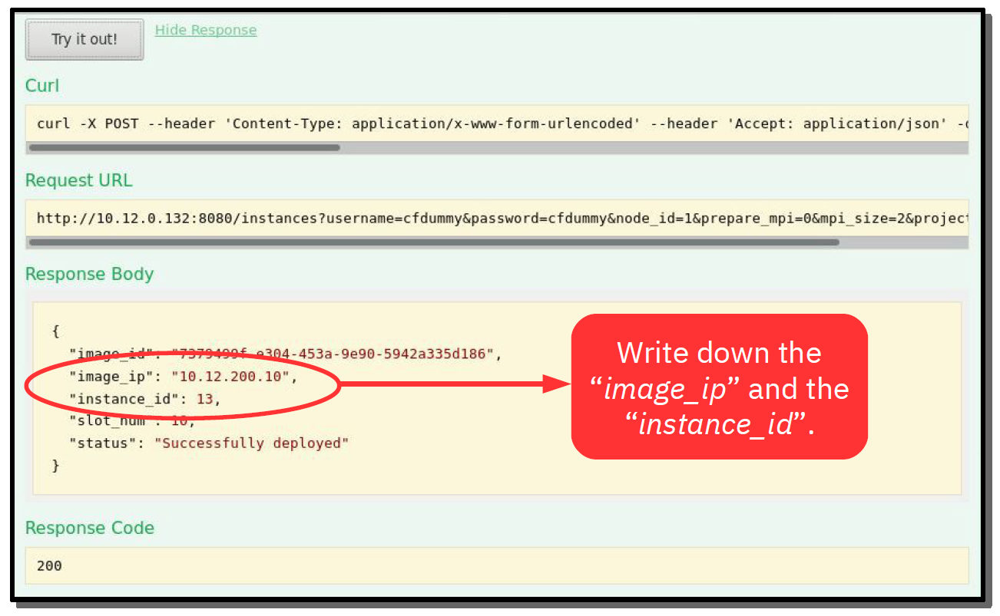

### Step-4: Ping the IP Address of the FPGA

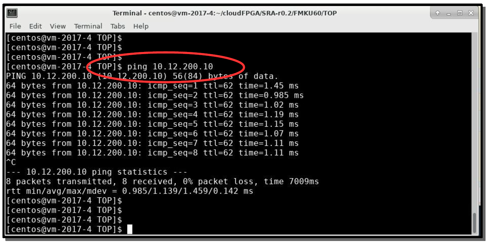


## Part-4: Remote Debugging with Vivado

### Step-1: Request Connection to HW Server

#### Step-1a: Point your browser at [http://10.12.0.132:8080/ui](http://10.12.0.132:8080/ui)
and expand the “Debug” section


#### Step-1b: Expand the “Get /debug/ila_connection/{instance_id}” operation

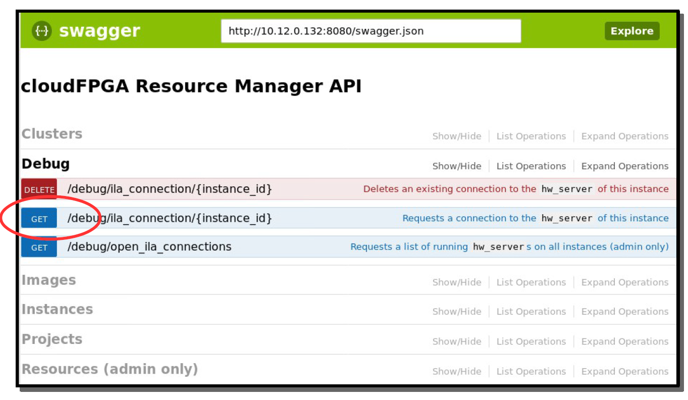

#### Step-1c: Fill in the parameter fields

Press the “Try it out!” button

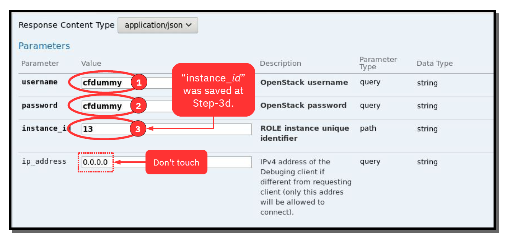

#### Step-1d: Check the “Response Body”

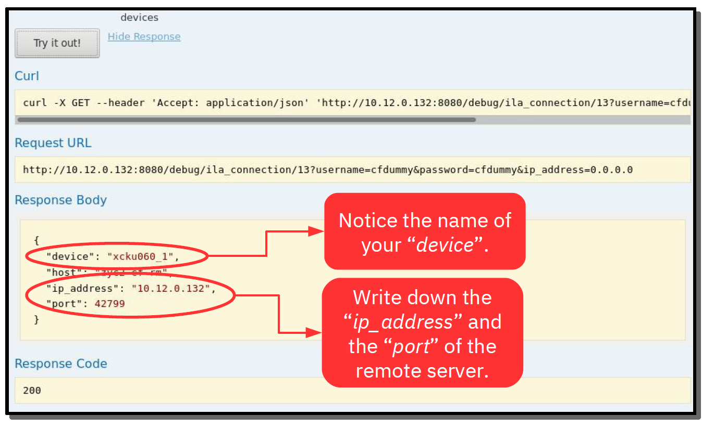

### Step-2: Launch Vivado
The Xilinx installation path on the ZYC2 VM:
`/tools/Xilinx/Vivado/2017.4/`

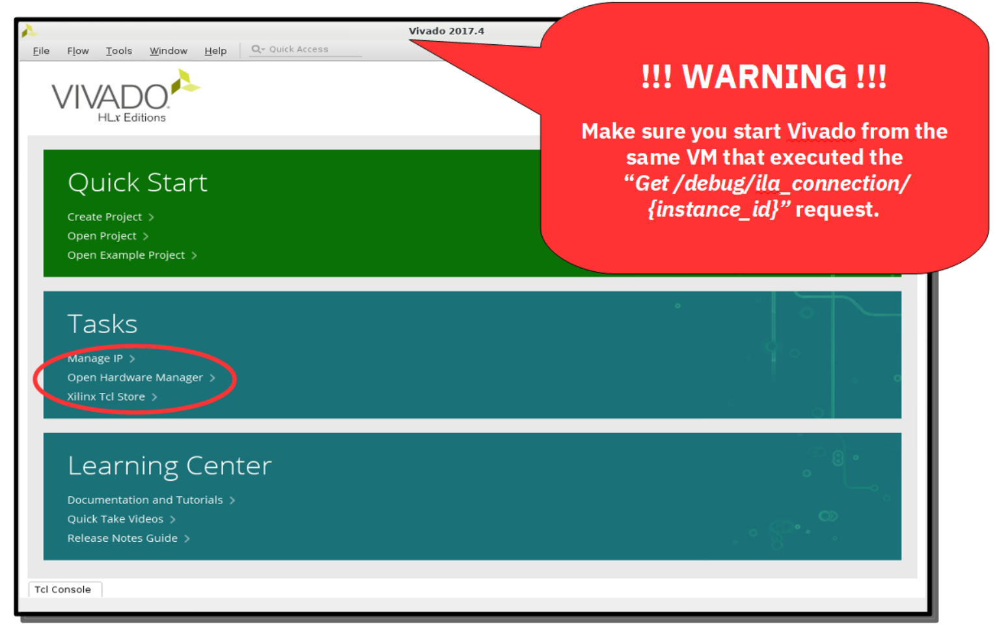

### Step-3:

#### Step-3a: Open the Hardware Server

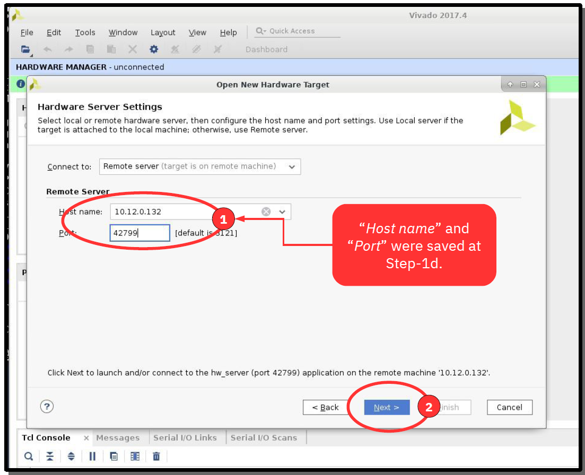

#### Step-3b: Select your Hardware Target

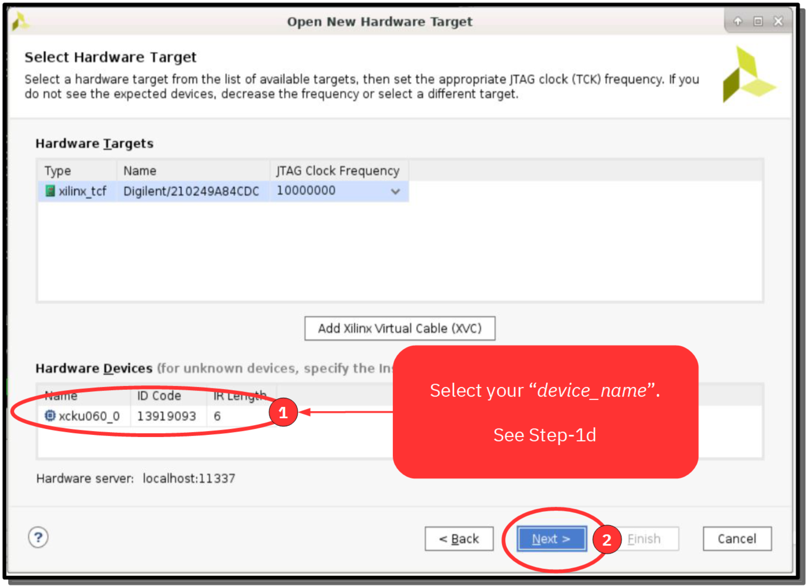

#### Step-3c: Here you go...

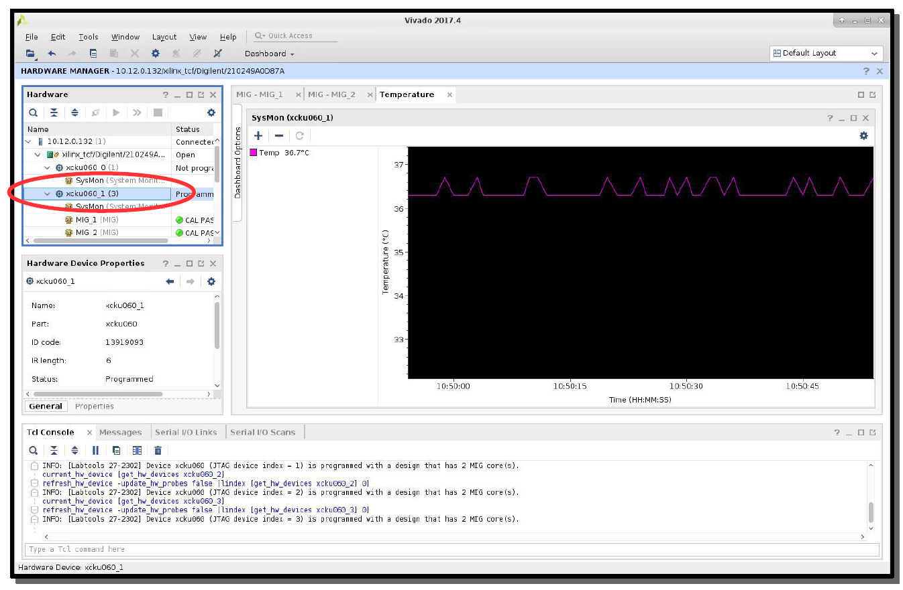

### Step-4: Further Instance Operations

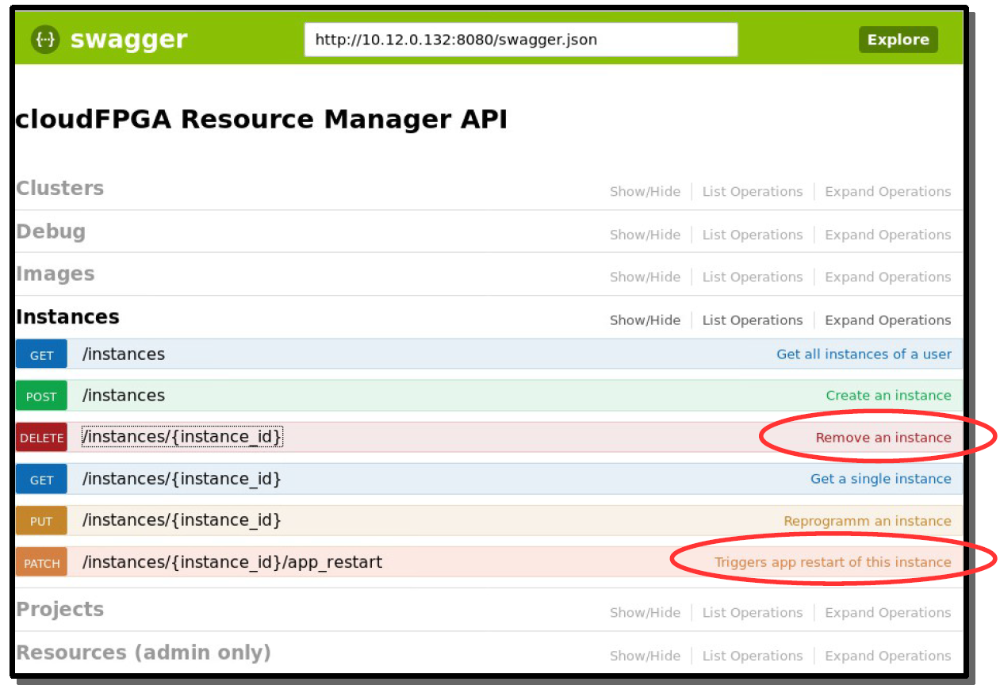

## Backup

### HowTo: “Hello World”
TopEchoHls (is a kind of 'Hello World')
```
cd ./SRA/FMKU60/TOP/TopEchoHls
make monolithic
```

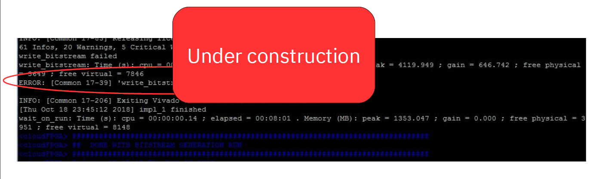

### HowTo: Test the UDP Loopback w/ netcat


