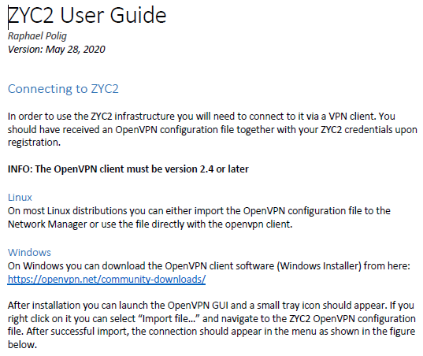

## Part-1: ZYC2 Access Authentication and Login

### Step-1: Get Access to ZYC2 & Create your VM(s)
Get Access to ZYC2 &amp; Create your VM(s)Register by sending a request to

Raphael Polig (pol@zurich.ibm.com)

Go through the steps of the [ZYC2 User Guide](./ZYC2_User_Guide.pdf) 

(Use CTRL+click or CMD+click to open file in a new tab).

