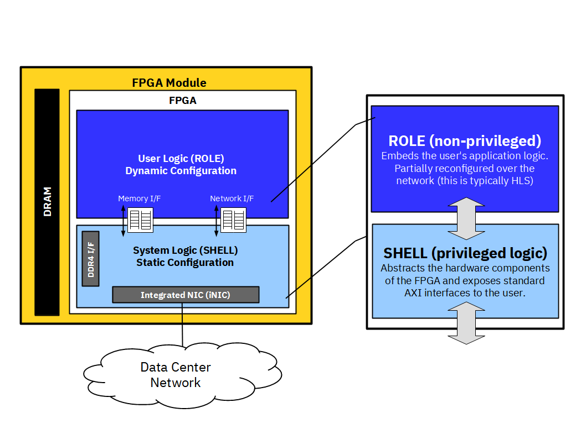

# cFDK
The **cloudFPGA Development Kit**.

## Introduction

The cloud service architecture of cloudFPGA is comparable to a cloud service hosting traditional 
servers and virtual machines. 
* In cF, the equivalent of the _CPU-based hardware resource_ is an _FPGA device_ and its 
surrounding board components. We refer to such an FPGA card as a cloudFPGA **Module** (MOD). 
* In cF, the equivalent of the _OS kernel_ is a piece of _reconfigurable logic_ that contains 
the custom interfaces and run-time logic to host and run a workload. We refer to such a kernel 
implemented in logic gates as a cloudFPGA **Shell** (SHL). 
* In cF, the equivalent of a _CPU application_ executed in user space is another piece of the 
FPGA _reconfigurable logic_. We refer to this user's custom logic as a cloudFPGA **Role** (ROL).

Multiple combinations exist between various Modules, Shells and Roles. Once a user has decided 
for a Module and a Shell to run his Role, it is the duty of the **cloudFPGA Development Kit** 
(cFDK) to assemble the tuple *{`MOD`, `SHL`, `ROL`}* into a so-called **cloudFPGA Project** (cFp), 
and to produce one or multiple corresponding _bitsream(s)_.



## The cF Module

The cloudFPGA service is designed to offer different types of FPGAs on various kinds of cards. 
As mentioned above, a specific assembly of an FPGA and its electronic card is referred to as a 
cloudFPGA **Module** (MOD). 

The following picture shows an example of such a cloudFPGA Module. It is called **FMKU60** to 
reflect its equipped *Xilinx Kintex UltraScale XCKU060* FPGA with *2x8GB* of DDR4 memory*. 
 


## The cF Shell

As mentioned in the introduction, a cloudFPGA **Shell** (SHL) contains all necessary I/O 
components, the run-time modules and the network stack that hooks the FPGA to the DC network. 
It further abstracts all these hardware components by exposing standard AXI interfaces to the user. 

A _cloudFPGA Module_ is designed to support different types of Shells. Therefore, a developer must 
decide for a specific `SHL` to use before creating a new application. 

Currently, the following shells are available:

 * [Kale](./DOC/Kale.md) - This shell provides minimalist support for accessing the hardware 
   components of the FPGA Module. The shell _Kale_ can only be used within a static implementation 
   of the Shell and the Role, and must therefore be programmed via JTAG. The following interfaces 
   are exposed to the Role:
    - a set of AXI-Stream interfaces for the UDP data and control paths,
    - a set of AXI-Stream interfaces for the TCP data and control paths,
    - one stream-based memory interface,
    - one memory-mapped interface.

 * [Themisto](./DOC/Themisto.md) - This shell provides enhanced routing support for node-to-node 
   communications. _Themisto_ is the current default cF Shell because it supports **Partial 
   Reconfiguration** (PR) and can therefore be paired with a dynamically configured `ROL`. 
   Additionally, the reconfiguration of such a role is performed by the _Themisto_ shell itself,
   upon reception of a new partial bitstream for the role via the TCP/IP network of the data center.
   The following interfaces 
   are exposed to the Role:
    - an AXI-Stream interface for the UDP data path,
    - an AXI-Stream interface for the TCP data path,
    - one stream-based memory interface,
    - one memory-mapped interface.

### The Shell-Role-Architecture

We refer to the concept of pairing a platform-specific part (i.e. the `SHL`) with an 
application-specific part (i.e. the `ROL`) as the **Shell-Role-Architecture** (SRA). 
This architectural approach is the base of the design pattern used by cFDK to assemble a 
pair of _{`SHL`, `ROL`}_ into a so-called **Toplevel** (TOP). Note that such an arrangement is 
always made of a statically configured `SHL`, while the `ROL` can either statically or dynamically 
configured, as depicted in the following figure.       


### The cF Project

Finally, the pairing of an FPGA design (i.e. a `SRA`) with a specific FPGA card (.i.e, a `MOD`) is 
what makes up a so-called **cloudFPGA Project** (cFp). The current `cFDK` repository contains all 
the source codes, the documentation and the build scripts that are necessary to create such a `cFp`. 

A the end, a `cFp` is what a designer uses to develop its application in _cloudFPGA_.   

### How to create a cloudFPGA Project

They are two ways to get started with a `cFp`.

If you are new to cloudFPGA, we recommend that you clone or copy an existing project 
(e.g. [cFp_HelloThemisto](https://github.com/cloudFPGA/cFp_HelloThemisto)) and that you 
start experimenting by modifying or removing its `ROL`. 

For the second and highly recommended approach, use the **cFCreate** framework when you need to 
create a new project from scratch or to manage and update an existing one. 
To use this framework, you need to clone the [cFCreate](https://github.com/cloudFPGA/cFCreate) 
repository into your *\<sandbox>* and setup a virtual environment for it. 
```
    $ cd <sandbox>
    $ git clone git@github.com:cloudFPGA/cFCreate.git
    $ cd cFCreate/
    $ which python3
    /usr/bin/python3.8
    $ virtualenv -p /usr/bin/python3.8 cfenv
    $ source cfenv/bin/activate
    $ pip install -r requirements.txt
```
From now on, you can create a new empty `cFp` with the following command: 
 ```
    $ cd <sandbox>
    $ ./cFCreate new --cfdk-version=latest --git-init <path-to-the-new-project-folder>
```
:Info: By convention, we recommend naming a project folder after the project itself while prefixing it with the string "*cFp_*" (e.g. [cFp_Zoo](https://github.com/cloudFPGA/cFp_Zoo)). 

For more information and more advanced options, please consult the documentation of the 
[cFCreate](https://github.com/cloudFPGA/cFCreate) repository.

### Typical cFp file structure

A typical `cFp` file structure looks as follows:
```
$ tree <cFp_ProjectName>
    cFDK/ (the cloudFPGA development kit as a submodule)
    TOP/  (the toplevel that integrates a SHELL and a ROLE) 
    └──tcl/ (don't touch, is copied from cFDK) 
    └──xdc/ (user added constraints; you add your debug nets here)
    └──hdl/ (HDL version of the toplevel)
       └──top.vhdl
       └── a.s.o. (if custom hdl files for TOP)
    ROLE/ (the user application(s))
    └── role1 (or not, depends on PR, etc.)
    └── role2 (or not, depends on cluster)
    └── a.s.o.
    dcps/ (contains the dcps and bitfiles)
    xpr/ (contains the Vivado project)
    ip/ (contains the IP cores (generated during build))
    Makefile
    env/
    └── setenv.sh (sets the envrionment)
    <possible_addons/>
```
