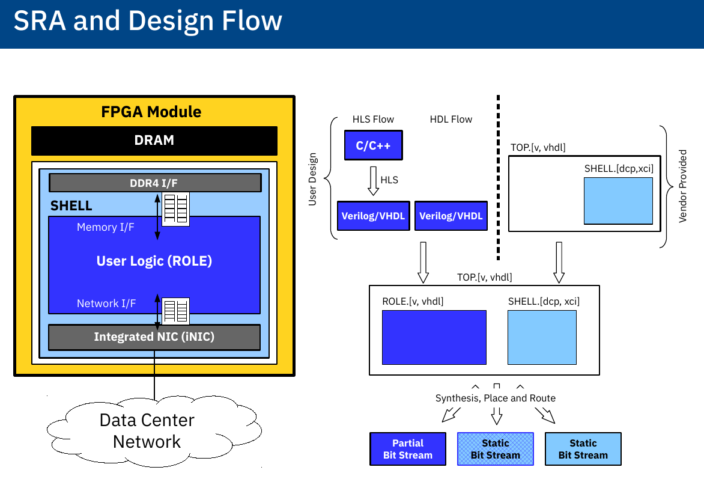

# cFDK

**cloudFPGA Development Kit (cFDK)**

The cFDK provides all the design files that are necessary to create a new cloudFPGA application, also called *cloudFPGA project (cFp)*.

cloudFPGA is designed to support different types of *Shells (SHELL or SHL)* and *FPGA Modules (MOD)*.
Before creating a new cFp, a designer must decide for a SHELL and a MOD, both are explained in the documentation section.

To set up a new cFp properly, the *cloudFPGA Build Framework* (cFBuild) is highly recommended!

## Overview

### Shell-Role-Architectures

To abstract the details of the hardware from the user and to assert certain levels of security, cloudFPGA uses a Shell-Role-Architecture (**SRA**).

Currently, the following SHELLs are available:
* [Kale](./DOC/Kale.md) This SHELL has one AXI-Stream for UDP and TCP each, as well as two stream-based memory ports.
* [Themisto](./DOC/Themisto.md) This SHELL enables node-to-node communication between multiple FPGA modules.

Details for the interfaces can be found in the linked documents.

### cloudFPGA Modules

The cloudFPGA service provides different types of FPGAs and module cards (**MOD**).

A picture of the module is shown below:

Currently, the following MODs are available:
* **FMKU60**: A module equipped with a *Xilinx Kintex UltraScale XCKU060* and  *2x8GB of DDR4 memory*. It is connected via *10GbE*.

### cloudFPGA example applications

Example applications (**APP**) are provided to demonstrate the usage of this Development Kit and to provide some code for learning.

Currently, the cFDK includes the following example APPs:

* `triangle_app`: To build a triangle cluster

### Create new applications

Follow the instructions of the [*cFBuild* documentation](https://github.ibm.com/cloudFPGA/cFBuild).
