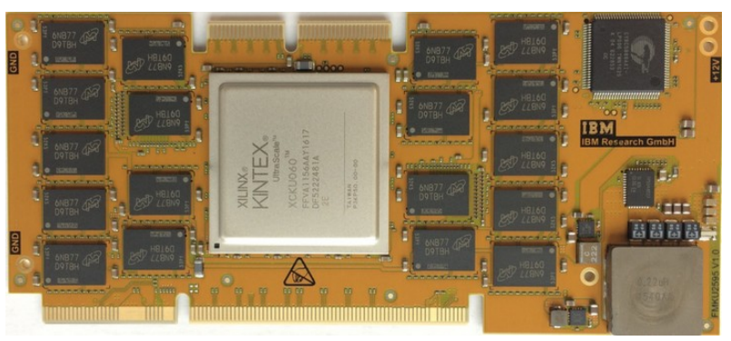

cFDK
================
**cloudFPGA Development Kit (cFDK)**

cFDK provides all design files that are necessary to create a new cloudFPGA application, also called *cloudFPGA project (cFp)*. 

On cloudFPGA, there are different types of *Shell-Role-Architectures (SRA)* and *FPGA Modules (MOD)* available. 
Before creating a new cFp, the designer must decide for a SRA and a MOD, both are explained in the documentation section.

To set up a new cFp properly, the *cloudFPGA Build Framework* (cFBuild) is highly recommended!

Documentation
-------------

### Shell-Role-Architectures

To abstract the details of the hardware from the user and to assert certain levels of security, cloudFPGA uses a Shell-Role-Architecture (SRA).

Currently, the following SRAs are available:
* [x1Udp_x1Tcp_x2Mp_x2Mc](./DOC/x1Udp_x1Tcp_x2Mp_x2Mc.md) This SRA has one AXI-Stream for UDP and TCP each, as well as two stream-based memory ports.
* [MPIv0_x2Mp_x2Mc](./DOC/MPIv0_x2Mp_x2Mc.md) This SRA has one stream-based MPI interface, as well as two stream-based memory ports.
* [Themisto](./DOC/Themisto.md) This SRA type enables node-to-node communication between multiple FPGA modules. 

Details for the interfaces can be found in the linked documents.

### cloudFPGA Modules

The cloudFPGA service provides different types of FPGAs and module cards (MOD).

The module looks like follows:

Currently, the following MODs are available:
* **FMKU60**: A module equipped with a *Xilinx Kintex UltraScale XCKU060* and  *2x8GB of DDR4 memory*. It is connected via *10GbE*.

Create new applications
------------------

Follow the instructions of the [*cFBuild* documentation](https://github.ibm.com/cloudFPGA/cFBuild).

